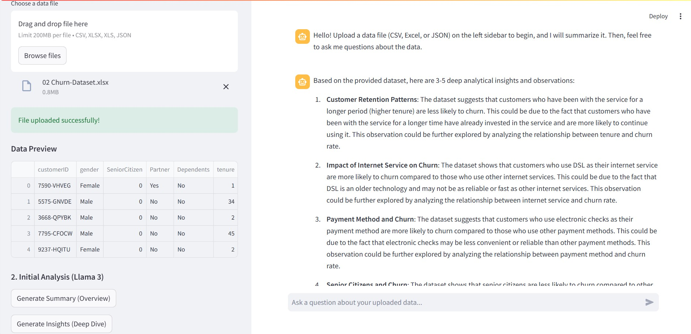
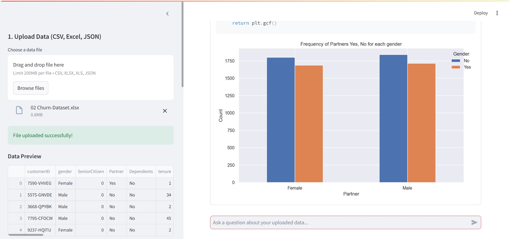

# 🤖 Data Analyst Conversational Exploratory Data Analysis (EDA) Tool


##Project Overview

This project is an interactive, web-based Exploratory Data Analysis (EDA) tool built with Streamlit and powered by the NVIDIA NIM Llama 3 language model via LangChain. It allows users to upload data and generate summaries, deep insights, and dynamic visualizations just by asking conversational questions.

---

## 🧭 Table of Contents

- [Prerequisites](#Prerequisites)
- [Project Structure](#-Project-structure)
- [Setup and Running Steps (PowerShell)](#Setup-and-Running-Steps-PowerShell)
- [Step 1: Clone the Repository](#Step-1-Clone-the-Repository)
- [Step 2: Create and Activate Virtual Environment](#Step-2-Create-and-Activate-Virtual-Environment)
- [Step 3: Install Dependencies](#Step-3-Install-Dependencies)
- [Step 4: Configure the API Key](#Step-4-Configure-the-API-Key)
- [Step 5: Run the Application](#Step-5-Run-the-Application)
- [Agent Snapshots](#Agent-Snapshots)
- [Future Scope](#Future-Scope)
- [Author and Contact](#-author-and-contact)

---

## Prerequisites

Ensure you have the following installed on your system before proceeding:

- ***🐍 Python***: Version 3.9 or higher.
- ***🔑 NVIDIA API Key***: Required to access the Llama 3 LLM endpoint via NVIDIA NIM.
- ***🛠️ Git***: Installed and configured for version control.

---

## 📊 Project Structure

The repository contains all the necessary files for setup and execution:

```bash
├── .env.template     # 🔑 Template for secure API Key storage (to be renamed to .env)
├── .gitignore        # 🚫 Specifies files to ignore (e.g., venv/, .env, local data)
├── eda\_agent.py      # 💻 Main Streamlit application and LLM logic
├── requirements.txt  # 📦 List of all required Python dependencies
├── README.md         # 📄 This instruction manual
├── Project\_Report.md # 📝 Detailed summary of technical architecture and LLM prompting
└── venv/             # (Virtual environment - ignored by Git)
```

---

## Setup and Running Steps (PowerShell)

Follow these commands in your PowerShell terminal to get the project running locally.

## Step 1: Clone the Repository

Clone your repository and navigate into the project directory:

```bash

# 1. Clone your repository (replace the URL with your GitHub link)

git clone <YOUR\_REPOSITORY\_URL\_HERE>

# 2. Navigate into the project directory

cd <YOUR\_PROJECT\_NAME>

```

## Step 2: Create and Activate Virtual Environment

A virtual environment ensures clean dependency management:

```bash

# 1. Create a virtual environment named 'venv'

python -m venv venv


# 2. Activate the virtual environment

.\venv\Scripts\Activate.ps1

```

(Your prompt will show `(venv)` once activated.)


## Step 3: Install Dependencies

Install all libraries specified in `requirements.txt`:

```bash

pip install -r requirements.txt

```

## Step 4: Configure the API Key

The application reads your secret key from the local `.env` file.


1. Copy the template file to create your local, private environment file:

```bash

Copy-Item .env.template .env

```

2. Open the newly created `.env` file and replace the placeholder:

```bash

NVIDIA\_API\_KEY="YOUR\_NVIDIA\_API\_KEY\_HERE"

```

Save the file. (The `.gitignore` will ensure this sensitive file is never uploaded.)


## Step 5: Run the Application

Start the Streamlit web application:

```bash

streamlit run eda\_agent.py

```

This command will automatically launch the Data Analyst Assistant in your web browser (typically at 'http://localhost:8501').

---

## Agent Snapshots:
Initially after uploading the data and asking for the summary the agent will look like


The visuals created by Agent looks like



## Future Scope

The project is built to be extensible. Potential areas for future development include:

📈 Advanced Statistical Modeling: Integrate the ability for the LLM to generate and run more complex models (e.g., time series analysis, survival models) and display their results in an interactive format.

🛠️ Tool Augmentation (Function Calling): Move from code generation within the prompt to using structured tool-calling (function calling) capabilities provided by the LLM, making code execution safer and more reliable.

💾 Database Integration: Allow users to connect directly to common databases (PostgreSQL, SQLite, MySQL) via credentials instead of only uploading static files.

🎨 Custom Visualizations: Provide a UI layer for users to customize the generated plots (e.g., changing colors, labels, or chart types) after the code has run, without needing to edit the Python code directly.

---

## 📧 Author and Contact

**Author:** Jayesh Sanjay Patil

**LinkedIn:** https://www.linkedin.com/in/jayesh-patil-83085521a

**Email:** jayeshpatil7530@gmail.com
